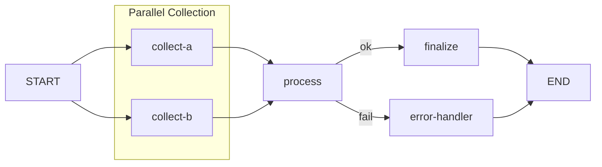

# Flow DSL Complete Syntax Reference

This document provides a complete syntax reference for the Flow DSL used in workflow definitions.

> **Document Note**: This document is based on Chapter 8 of `cc-workflow-design.md` and has been extended in the following sections:
> - Condition expression syntax (detailed operator descriptions)
> - Error handling patterns (Retry/Fallback/Circuit Breaker)
> - Best practices (naming conventions, grouping recommendations, error handling recommendations)
>
> Extended content is marked as `[Extended]`.

## Basic Syntax

### Symbols Overview

| Symbol | Meaning | Example | Description |
|--------|---------|---------|-------------|
| `>>` | Sequential dependency | `a >> b >> c` | a completes, then b, then c |
| `[a, b]` | Parallel group | `x >> [a, b] >> y` | a and b run in parallel, y waits for all |
| `?label` | Conditional branch | `a ?ok >> b` | Execute b when a output satisfies ok condition |
| `* $var` | Loop iteration | `a * $items` | Execute a for each item in $items |
| `* $var[n]` | Parallel loop | `a * $items[3]` | Parallel iteration with degree 3 |
| `START` | Entry point | `START >> a` | Workflow entry |
| `END` | Exit point | `a >> END` | Workflow exit |

## Detailed Syntax Rules

### 1. Sequential Execution

```yaml
flow: |
  START >> step-a >> step-b >> step-c >> END
```

Execution order: START → step-a → step-b → step-c → END

### 2. Parallel Execution

```yaml
flow: |
  # Parallel start
  START >> [collect-a, collect-b, collect-c] >> merge >> END

  # Equivalent to:
  # START → collect-a ─┐
  # START → collect-b ─┼→ merge → END
  # START → collect-c ─┘
```

**Rules:**
- All nodes in `[]` start simultaneously
- Next node waits for all parallel nodes to complete
- No order guarantee within parallel group

### 3. Conditional Branching

```yaml
flow: |
  START >> analyze >> END
  analyze ?issues >> fix-issues >> END
  analyze ?clean >> approve >> END
  analyze ?unknown >> manual-review >> END

conditions:
  analyze:
    issues: "output.issue_count > 0"
    clean: "output.issue_count == 0"
    unknown: "output.confidence < 0.8"
```

**Rules:**
- Use `?label` to specify condition name
- Conditions defined in `conditions` section
- Condition expression evaluates node output
- Multiple conditions can match (non-exclusive)

### 4. Loop Iteration

```yaml
flow: |
  # Sequential loop
  START >> processor * $files >> merge >> END

  # Parallel loop (max 3 concurrent)
  START >> processor * $files[3] >> merge >> END

  # Loop + condition
  START >> validator * $items >> check ?all_valid >> finalize >> END
  check ?has_errors >> error-report >> END
```

**Rules:**
- `* $var` iterates over state variable
- `* $var[n]` specifies parallel degree n
- Loop variable available to node via context
- Next node waits for all iterations to complete

### 5. Combining Patterns

```yaml
name: code-review-workflow
version: "1.0"

state:
  files: []
  reviews: []

flow: |
  # Main flow: fetch PR → parallel checks → analyze → handle results
  START >> fetch-pr >> [lint, test, security] >> analyze
  analyze ?issues >> generate-fixes >> END
  analyze ?clean >> approve >> END

  # File-level review: parallel review for each file
  fetch-pr >> reviewer * $files[3] >> summarize >> END

conditions:
  analyze:
    issues: "output.issue_count > 0"
    clean: "output.issue_count == 0"

execution:
  max_parallel: 5
  timeout: 1800
```

## Flow File Structure

### Complete Format

```yaml
# Workflow metadata
name: workflow-name
version: "1.0"
description: Workflow description

# State definition (optional)
state:
  items: []
  result: null

# Flow definition
flow: |
  START >> fetch-data >> [validate, transform] >> process >> END
  process ?success >> finalize >> END
  process ?retry >> process
  process ?fail >> error-handler >> END
  batch-processor * $items[3] >> merge >> END

# Condition definitions (when using conditional branches)
conditions:
  process:
    success: "output.status == 'ok'"
    retry: "output.retry_count < 3"
    fail: "output.status == 'error'"

# Execution configuration
execution:
  max_parallel: 3
  timeout: 3600
```

### Field Description

| Field | Type | Required | Description |
|-------|------|----------|-------------|
| `name` | string | Yes | Workflow name |
| `version` | string | Yes | Version number |
| `description` | string | No | Workflow description |
| `state` | object | No | Initial state variables |
| `flow` | string | Yes | Flow DSL definition |
| `conditions` | object | No | Condition expressions |
| `execution` | object | No | Execution configuration |

## Output Formats

Flow definitions can automatically convert to three formats for different scenarios.

### 1. Mermaid Diagram (Visualization)

**Original Flow:**
```yaml
flow: |
  START >> [collect-a, collect-b] >> process ?ok >> finalize >> END
  process ?fail >> error-handler >> END
```

**Generated Mermaid:**


### 2. Structured Text (Agent Understanding)

```
Workflow: code-review-workflow

Execution Path:
1. START → fetch-pr
2. fetch-pr → [lint, test, security] (parallel, wait for all)
3. [lint, test, security] → analyze
4. analyze branches:
   - Condition "issues" (issue_count > 0): → generate-fixes → END
   - Condition "clean" (issue_count == 0): → approve → END
5. fetch-pr → reviewer (loop: $files, parallel: 3) → summarize → END

Dependencies:
- fetch-pr: no dependencies
- lint, test, security: depends on fetch-pr
- analyze: depends on lint, test, security (all complete)
- generate-fixes: depends on analyze (condition: issues)
- approve: depends on analyze (condition: clean)
- reviewer: depends on fetch-pr (loop)
- summarize: depends on reviewer (loop complete)
```

### 3. DAG JSON (Programmatic Processing)

```json
{
  "name": "code-review-workflow",
  "version": "1.0",
  "nodes": [
    {"id": "START", "type": "start"},
    {"id": "fetch-pr", "type": "agent", "agent": "fetch-pr"},
    {"id": "lint", "type": "agent", "agent": "lint"},
    {"id": "test", "type": "agent", "agent": "test"},
    {"id": "security", "type": "agent", "agent": "security"},
    {"id": "analyze", "type": "agent", "agent": "analyze"},
    {"id": "generate-fixes", "type": "agent", "agent": "generate-fixes"},
    {"id": "approve", "type": "agent", "agent": "approve"},
    {"id": "reviewer", "type": "loop", "agent": "reviewer", "over": "$files", "parallel": 3},
    {"id": "summarize", "type": "agent", "agent": "summarize"},
    {"id": "END", "type": "end"}
  ],
  "edges": [
    {"from": "START", "to": "fetch-pr"},
    {"from": "fetch-pr", "to": "lint", "parallel_group": "checks"},
    {"from": "fetch-pr", "to": "test", "parallel_group": "checks"},
    {"from": "fetch-pr", "to": "security", "parallel_group": "checks"},
    {"from": "lint", "to": "analyze", "trigger_rule": "all_success"},
    {"from": "test", "to": "analyze", "trigger_rule": "all_success"},
    {"from": "security", "to": "analyze", "trigger_rule": "all_success"},
    {"from": "analyze", "to": "generate-fixes", "condition": "issues"},
    {"from": "analyze", "to": "approve", "condition": "clean"},
    {"from": "generate-fixes", "to": "END"},
    {"from": "approve", "to": "END"},
    {"from": "fetch-pr", "to": "reviewer"},
    {"from": "reviewer", "to": "summarize"},
    {"from": "summarize", "to": "END"}
  ],
  "conditions": {
    "analyze": {
      "issues": "output.issue_count > 0",
      "clean": "output.issue_count == 0"
    }
  }
}
```

## Conversion Rules

### Flow → Mermaid

| Flow Syntax | Mermaid Syntax | Description |
|-------------|----------------|-------------|
| `a >> b` | `a --> b` | Direct mapping |
| `a >> [b, c]` | `a --> b` + `a --> c` + `subgraph` | Expand parallel, add subgraph |
| `[a, b] >> c` | `a --> c` + `b --> c` | Convergence |
| `a ?label >> b` | `a -->\|label\| b` | Condition label |
| `a * $items` | `subgraph loop` + comment | Loop subgraph |
| `a * $items[n]` | `subgraph loop[∀ item ×n]` | Parallel loop subgraph |

## Condition Expression Syntax [Extended]

> The following operators and field access syntax are extended content; the source document only provides simple examples.

### Supported Operators

| Operator | Description | Example |
|----------|-------------|---------|
| `==` | Equal | `output.status == 'ok'` |
| `!=` | Not equal | `output.status != 'error'` |
| `>` | Greater than | `output.count > 0` |
| `<` | Less than | `output.count < 10` |
| `>=` | Greater or equal | `output.score >= 80` |
| `<=` | Less or equal | `output.score <= 100` |
| `in` | Contains | `'error' in output.messages` |
| `and` | Logical AND | `output.valid and output.complete` |
| `or` | Logical OR | `output.retry or output.skip` |
| `not` | Logical NOT | `not output.error` |

### Accessing Output Fields

```yaml
conditions:
  node-name:
    # Access simple field
    simple: "output.status == 'ok'"

    # Access nested field
    nested: "output.result.score > 80"

    # Access array length
    array: "len(output.items) > 0"

    # Access array element
    element: "output.items[0].valid"
```

## Error Handling Patterns [Extended]

> The following error handling patterns are extended content, supplemented based on workflow design best practices.

### Retry Pattern

```yaml
flow: |
  START >> process >> END
  process ?retry >> process

conditions:
  process:
    retry: "output.status == 'retry' and output.attempt < 3"
```

### Fallback Pattern

```yaml
flow: |
  START >> primary >> END
  primary ?fail >> fallback >> END

conditions:
  primary:
    fail: "output.status == 'error'"
```

### Circuit Breaker Pattern

```yaml
flow: |
  START >> check-health >> process >> END
  check-health ?unhealthy >> skip >> END

conditions:
  check-health:
    unhealthy: "output.error_rate > 0.5"
```

## Best Practices [Extended]

> The following best practices are extended content, supplemented based on workflow design experience.

### 1. Clear Naming

```yaml
# Good: Descriptive names
flow: |
  START >> fetch-user-data >> validate-schema >> transform-format >> END

# Avoid: Ambiguous names
flow: |
  START >> step1 >> step2 >> step3 >> END
```

### 2. Appropriate Grouping

```yaml
# Good: Logical parallel groups
flow: |
  START >> [lint-code, run-tests, check-security] >> merge-results >> END

# Avoid: Unrelated parallel execution
flow: |
  START >> [fetch-data, send-email] >> END
```

### 3. Explicit Error Handling

```yaml
# Good: Handle all outcomes
flow: |
  START >> process >> END
  process ?success >> notify-success >> END
  process ?failure >> notify-failure >> END
  process ?timeout >> retry >> process

# Avoid: Implicit error handling
flow: |
  START >> process >> END
```

### 4. Condition Clarity

```yaml
# Good: Clear condition expressions
conditions:
  analyze:
    has_issues: "output.issue_count > 0"
    is_clean: "output.issue_count == 0 and output.warnings == 0"

# Avoid: Complex inline conditions
conditions:
  analyze:
    check: "output.a > 0 and (output.b < 10 or output.c == 'x') and not output.d"
```
