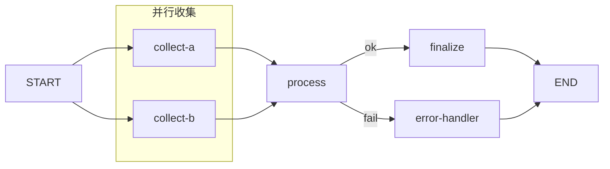

# Flow DSL 完整语法参考

本文档提供工作流定义中使用的 Flow DSL 完整语法参考。

> **文档说明**：本文档基于 `cc-workflow-design.md` 第 8 章内容整理，并在以下部分进行了扩展：
> - 条件表达式语法（详细的运算符说明）
> - 错误处理模式（Retry/Fallback/Circuit Breaker）
> - 最佳实践（命名规范、分组建议、错误处理建议）
>
> 扩展内容标注为 `[扩展]`。

## 基础语法

### 符号概览

| 符号 | 含义 | 示例 | 说明 |
|------|------|------|------|
| `>>` | 顺序依赖 | `a >> b >> c` | a 完成后执行 b，然后 c |
| `[a, b]` | 并行组 | `x >> [a, b] >> y` | a 和 b 并行执行，y 等待所有完成 |
| `?label` | 条件分支 | `a ?ok >> b` | 当 a 的输出满足 ok 条件时执行 b |
| `* $var` | 循环迭代 | `a * $items` | 对 $items 中的每个元素执行 a |
| `* $var[n]` | 并行循环 | `a * $items[3]` | 并行度为 3 的循环迭代 |
| `START` | 入口点 | `START >> a` | 工作流入口 |
| `END` | 出口点 | `a >> END` | 工作流出口 |

## 详细语法规则

### 1. 顺序执行

```yaml
flow: |
  START >> step-a >> step-b >> step-c >> END
```

执行顺序: START → step-a → step-b → step-c → END

### 2. 并行执行

```yaml
flow: |
  # 并行启动
  START >> [collect-a, collect-b, collect-c] >> merge >> END

  # 等同于:
  # START → collect-a ─┐
  # START → collect-b ─┼→ merge → END
  # START → collect-c ─┘
```

**规则:**
- `[]` 中的所有节点同时启动
- 下一个节点等待所有并行节点完成
- 并行组内无执行顺序保证

### 3. 条件分支

```yaml
flow: |
  START >> analyze >> END
  analyze ?issues >> fix-issues >> END
  analyze ?clean >> approve >> END
  analyze ?unknown >> manual-review >> END

conditions:
  analyze:
    issues: "output.issue_count > 0"
    clean: "output.issue_count == 0"
    unknown: "output.confidence < 0.8"
```

**规则:**
- 使用 `?label` 指定条件名称
- 条件在 `conditions` 部分定义
- 条件表达式评估节点输出
- 多个条件可以同时匹配（非互斥）

### 4. 循环迭代

```yaml
flow: |
  # 顺序循环
  START >> processor * $files >> merge >> END

  # 并行循环（最多 3 个并发）
  START >> processor * $files[3] >> merge >> END

  # 循环 + 条件
  START >> validator * $items >> check ?all_valid >> finalize >> END
  check ?has_errors >> error-report >> END
```

**规则:**
- `* $var` 遍历状态变量
- `* $var[n]` 指定并行度 n
- 循环变量通过 context 传递给节点
- 下一个节点等待所有迭代完成

### 5. 组合模式

```yaml
name: code-review-workflow
version: "1.0"

state:
  files: []
  reviews: []

flow: |
  # 主流程: 获取 PR → 并行检查 → 分析 → 处理结果
  START >> fetch-pr >> [lint, test, security] >> analyze
  analyze ?issues >> generate-fixes >> END
  analyze ?clean >> approve >> END

  # 文件级评审: 对每个文件并行评审
  fetch-pr >> reviewer * $files[3] >> summarize >> END

conditions:
  analyze:
    issues: "output.issue_count > 0"
    clean: "output.issue_count == 0"

execution:
  max_parallel: 5
  timeout: 1800
```

## Flow 文件结构

### 完整格式

```yaml
# 工作流元数据
name: workflow-name
version: "1.0"
description: 工作流描述

# 状态定义（可选）
state:
  items: []
  result: null

# 流程定义
flow: |
  START >> fetch-data >> [validate, transform] >> process >> END
  process ?success >> finalize >> END
  process ?retry >> process
  process ?fail >> error-handler >> END
  batch-processor * $items[3] >> merge >> END

# 条件定义（使用条件分支时）
conditions:
  process:
    success: "output.status == 'ok'"
    retry: "output.retry_count < 3"
    fail: "output.status == 'error'"

# 执行配置
execution:
  max_parallel: 3
  timeout: 3600
```

### 字段说明

| 字段 | 类型 | 必填 | 说明 |
|------|------|------|------|
| `name` | string | 是 | 工作流名称 |
| `version` | string | 是 | 版本号 |
| `description` | string | 否 | 工作流描述 |
| `state` | object | 否 | 初始状态变量 |
| `flow` | string | 是 | Flow DSL 定义 |
| `conditions` | object | 否 | 条件表达式 |
| `execution` | object | 否 | 执行配置 |

## 输出格式

Flow 定义可自动转换为三种格式，适用于不同场景。

### 1. Mermaid 图（可视化）

**原始 Flow:**
```yaml
flow: |
  START >> [collect-a, collect-b] >> process ?ok >> finalize >> END
  process ?fail >> error-handler >> END
```

**生成的 Mermaid:**

```mermaid
flowchart LR
    START --> collect-a
    START --> collect-b

    subgraph parallel_1[并行收集]
        collect-a
        collect-b
    end

    collect-a --> process
    collect-b --> process

    process -->|ok| finalize --> END
    process -->|fail| error-handler --> END
```

### 2. 结构化文本（Agent 理解）

```
工作流: code-review-workflow

执行路径:
1. START → fetch-pr
2. fetch-pr → [lint, test, security] (并行，等待全部完成)
3. [lint, test, security] → analyze
4. analyze 分支:
   - 条件 "issues" (issue_count > 0): → generate-fixes → END
   - 条件 "clean" (issue_count == 0): → approve → END
5. fetch-pr → reviewer (循环: $files, 并行度: 3) → summarize → END

依赖关系:
- fetch-pr: 无依赖
- lint, test, security: 依赖 fetch-pr
- analyze: 依赖 lint, test, security（全部完成）
- generate-fixes: 依赖 analyze（条件: issues）
- approve: 依赖 analyze（条件: clean）
- reviewer: 依赖 fetch-pr（循环）
- summarize: 依赖 reviewer（循环完成）
```

### 3. DAG JSON（程序化处理）

```json
{
  "name": "code-review-workflow",
  "version": "1.0",
  "nodes": [
    {"id": "START", "type": "start"},
    {"id": "fetch-pr", "type": "agent", "agent": "fetch-pr"},
    {"id": "lint", "type": "agent", "agent": "lint"},
    {"id": "test", "type": "agent", "agent": "test"},
    {"id": "security", "type": "agent", "agent": "security"},
    {"id": "analyze", "type": "agent", "agent": "analyze"},
    {"id": "generate-fixes", "type": "agent", "agent": "generate-fixes"},
    {"id": "approve", "type": "agent", "agent": "approve"},
    {"id": "reviewer", "type": "loop", "agent": "reviewer", "over": "$files", "parallel": 3},
    {"id": "summarize", "type": "agent", "agent": "summarize"},
    {"id": "END", "type": "end"}
  ],
  "edges": [
    {"from": "START", "to": "fetch-pr"},
    {"from": "fetch-pr", "to": "lint", "parallel_group": "checks"},
    {"from": "fetch-pr", "to": "test", "parallel_group": "checks"},
    {"from": "fetch-pr", "to": "security", "parallel_group": "checks"},
    {"from": "lint", "to": "analyze", "trigger_rule": "all_success"},
    {"from": "test", "to": "analyze", "trigger_rule": "all_success"},
    {"from": "security", "to": "analyze", "trigger_rule": "all_success"},
    {"from": "analyze", "to": "generate-fixes", "condition": "issues"},
    {"from": "analyze", "to": "approve", "condition": "clean"},
    {"from": "generate-fixes", "to": "END"},
    {"from": "approve", "to": "END"},
    {"from": "fetch-pr", "to": "reviewer"},
    {"from": "reviewer", "to": "summarize"},
    {"from": "summarize", "to": "END"}
  ],
  "conditions": {
    "analyze": {
      "issues": "output.issue_count > 0",
      "clean": "output.issue_count == 0"
    }
  }
}
```

## 转换规则

### Flow → Mermaid

| Flow 语法 | Mermaid 语法 | 说明 |
|-----------|--------------|------|
| `a >> b` | `a --> b` | 直接映射 |
| `a >> [b, c]` | `a --> b` + `a --> c` + `subgraph` | 展开并行，添加子图 |
| `[a, b] >> c` | `a --> c` + `b --> c` | 汇聚 |
| `a ?label >> b` | `a -->\|label\| b` | 条件标签 |
| `a * $items` | `subgraph loop` + 注释 | 循环子图 |
| `a * $items[n]` | `subgraph loop[∀ item ×n]` | 并行循环子图 |

## 条件表达式语法 [扩展]

> 以下运算符和字段访问语法为扩展内容，源文档仅给出简单示例。

### 支持的运算符

| 运算符 | 说明 | 示例 |
|--------|------|------|
| `==` | 相等 | `output.status == 'ok'` |
| `!=` | 不相等 | `output.status != 'error'` |
| `>` | 大于 | `output.count > 0` |
| `<` | 小于 | `output.count < 10` |
| `>=` | 大于等于 | `output.score >= 80` |
| `<=` | 小于等于 | `output.score <= 100` |
| `in` | 包含 | `'error' in output.messages` |
| `and` | 逻辑与 | `output.valid and output.complete` |
| `or` | 逻辑或 | `output.retry or output.skip` |
| `not` | 逻辑非 | `not output.error` |

### 访问输出字段

```yaml
conditions:
  node-name:
    # 访问简单字段
    simple: "output.status == 'ok'"

    # 访问嵌套字段
    nested: "output.result.score > 80"

    # 访问数组长度
    array: "len(output.items) > 0"

    # 访问数组元素
    element: "output.items[0].valid"
```

## 错误处理模式 [扩展]

> 以下错误处理模式为扩展内容，基于工作流设计最佳实践补充。

### Retry 模式

```yaml
flow: |
  START >> process >> END
  process ?retry >> process

conditions:
  process:
    retry: "output.status == 'retry' and output.attempt < 3"
```

### Fallback 模式

```yaml
flow: |
  START >> primary >> END
  primary ?fail >> fallback >> END

conditions:
  primary:
    fail: "output.status == 'error'"
```

### Circuit Breaker 模式

```yaml
flow: |
  START >> check-health >> process >> END
  check-health ?unhealthy >> skip >> END

conditions:
  check-health:
    unhealthy: "output.error_rate > 0.5"
```

## 最佳实践 [扩展]

> 以下最佳实践为扩展内容，基于工作流设计经验补充。

### 1. 清晰命名

```yaml
# 好：描述性名称
flow: |
  START >> fetch-user-data >> validate-schema >> transform-format >> END

# 避免：模糊名称
flow: |
  START >> step1 >> step2 >> step3 >> END
```

### 2. 合理分组

```yaml
# 好：逻辑相关的并行组
flow: |
  START >> [lint-code, run-tests, check-security] >> merge-results >> END

# 避免：不相关的并行执行
flow: |
  START >> [fetch-data, send-email] >> END
```

### 3. 显式错误处理

```yaml
# 好：处理所有可能的结果
flow: |
  START >> process >> END
  process ?success >> notify-success >> END
  process ?failure >> notify-failure >> END
  process ?timeout >> retry >> process

# 避免：隐式错误处理
flow: |
  START >> process >> END
```

### 4. 条件清晰

```yaml
# 好：清晰的条件表达式
conditions:
  analyze:
    has_issues: "output.issue_count > 0"
    is_clean: "output.issue_count == 0 and output.warnings == 0"

# 避免：复杂的内联条件
conditions:
  analyze:
    check: "output.a > 0 and (output.b < 10 or output.c == 'x') and not output.d"
```
